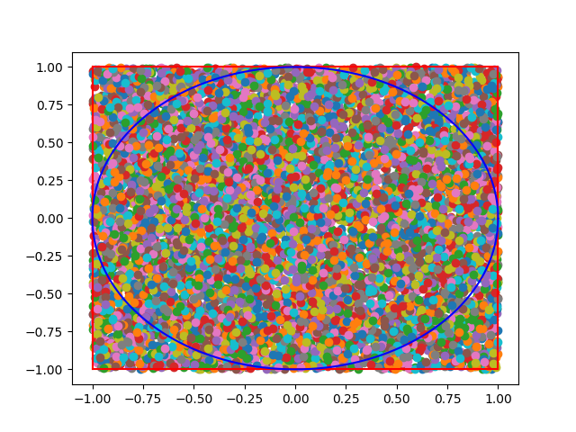

# Monte Carlo Method
Monte Carlo Method uses randomness to solve problems that are deterministic. 
1. Define a domain of possible inputs
2. Generate inputs randomly from a probability distribution over the domain
3. Perform a deterministic computation on the inputs
4. Group the results

# Example Finding PI
1. Draw a square and circle
2. Generate guassian random number of points
3. Count the number of points inside the square and circle
4. Determine pi from the area of circle/square.

area of circle = $r^2 pi$

area of square = $(2r)^2$

area circle(count)/area square(count) = $r^2 pi / (2r)^2 = pi/4$

$pi = 4*circle/square$

1. points need to be uniformly distributed
2. Approximation will be poor if not enough points; need many points placed.

# Results
expected   pi: 3.141592653589793

calculated pi: 3.138

# Plots
Generated 10000 points within the domain of [-1, 1] in x axis and [-1, 1] in y axis. The radius of the circle is 1 unit and the length of the square is 2 unit. 

The approximation of Pi will converge with enough number of points. Pi is the ratio of number of points in the circle over the number of points in the square.

# Reference
[Monte Carlo Wiki](https://en.wikipedia.org/wiki/Monte_Carlo_method)
